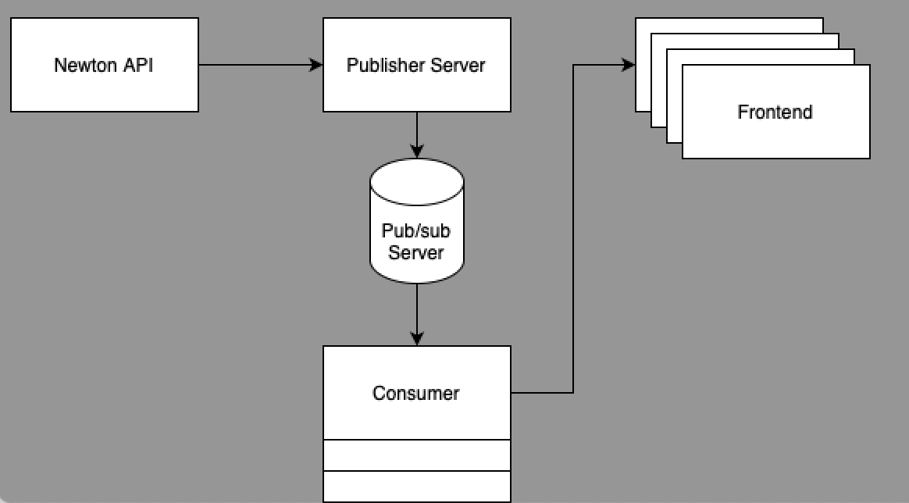

# Newton_Websocket_Project
# Newton_Frontend
To run install pip install -r requirements.txt 
and then run to setup the websocket project
daphne -b 127.0.0.1 -p 8000 websocket_project.asgi:application
